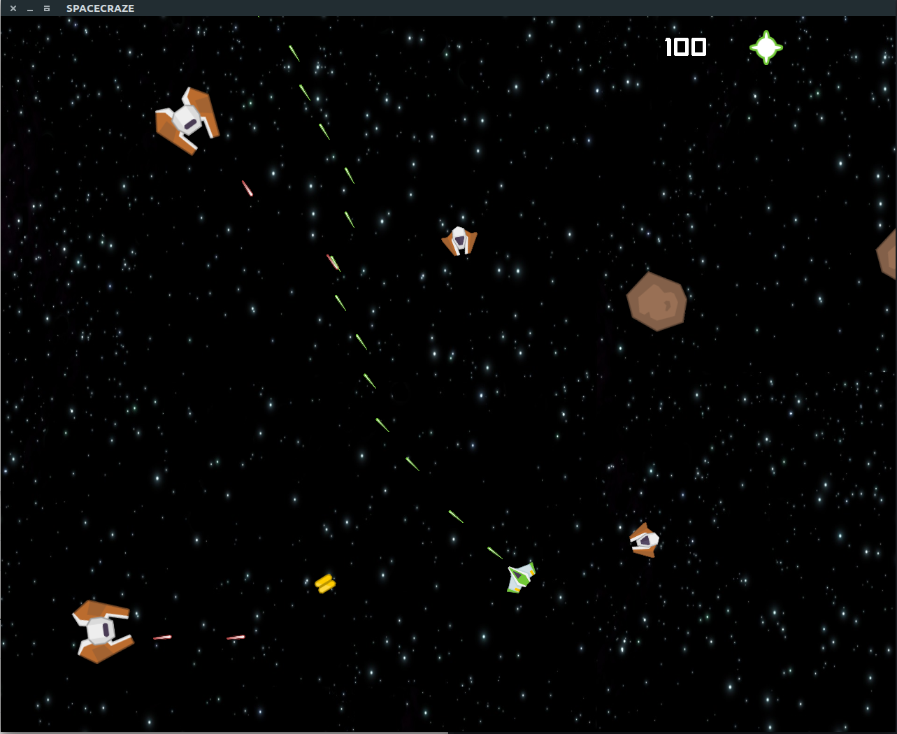

# Spacecraze

Spacecraze is a simple 2D space shooter developed using C++14 and SDL2 where the goal is to stay alive
for as long as you can. There are three types of enemies: *Drones*, which
are small and fragile and will try to collide with you; *Blasters* which are
larger, have more health and will shoot at you; *Asteroids* who will float
around the map.

You can only sustain one hit.

During the game powerups will spawn (only bonus damage is currently implemented).
